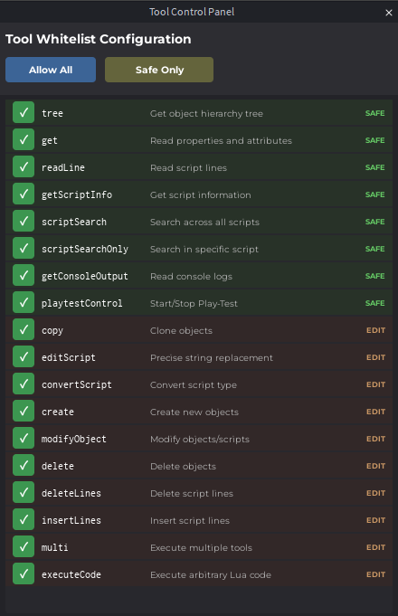

# Roblox Studio MCP Server

A Model Context Protocol (MCP) server for Roblox Studio integration using **WebSocket** for real-time bidirectional communication.

## 🚀 Features

- **WebSocket Communication**: Direct real-time connection between MCP server and Roblox Studio
- **17 Roblox Studio Tools**: Complete set of tools for object manipulation, script editing, and more
- **Tool Control Panel**: Built-in UI in Roblox Studio to enable/disable specific tools
- **Auto-Reconnect**: Robust connection handling with automatic reconnection

## 📦 Architecture

```
┌─────────────────┐     stdio      ┌─────────────────┐
│   AI (Claude)   │◄──────────────►│   MCP Server    │
│   Cursor, etc.  │                │  (mcp-server.js)│
└─────────────────┘                └────────┬────────┘
                                            │
                                     WebSocket (port 3001)
                                            │
                                   ┌────────▼────────┐
                                   │  Roblox Plugin  │
                                   │  (in Roblox     │
                                   │   Studio)       │
                                   └─────────────────┘
```

## 🔧 Installation

### Option 1: Install via npm (Recommended)

```bash
npm install -g roblox-mcp-vitja
```

### Option 2: Install from GitHub

```bash
git clone https://github.com/Vltja/Roblox-MCP.git
cd Roblox-MCP
npm install
```

### Configure MCP Client

Add to your MCP client configuration (Claude Desktop, Cursor, etc.):

**With npm global install:**
```json
{
  "mcpServers": {
    "roblox-studio": {
      "command": "roblox-mcp-vitja",
      "env": {
        "MCP_WS_PORT": "3001"
      }
    }
  }
}
```

**From source:**
```json
{
  "mcpServers": {
    "roblox-studio": {
      "command": "node",
      "args": ["/path/to/Roblox-MCP/mcp-server.js"],
      "env": {
        "MCP_WS_PORT": "3001"
      }
    }
  }
}
```

## 🎮 Roblox Studio Plugin

The Roblox Studio plugin is **required** for the MCP server to communicate with Roblox Studio.

> **Note**: The plugin is distributed separately. Contact the author for access.

### Plugin Setup
1. Install the plugin in Roblox Studio
2. Open the **MCP Settings** panel from the toolbar
3. Configure the server IP (default: `localhost`)
4. Configure the WebSocket port (default: `3001`)
5. Click **Connect**

## 🛠️ Available Tools

| Tool | Description | Permission |
|------|-------------|------------|
| `tree` | Get object hierarchy tree | SAFE |
| `get` | Read properties and attributes | SAFE |
| `readLine` | Read specific script lines | SAFE |
| `getScriptInfo` | Get script metadata | SAFE |
| `scriptSearch` | Search across all scripts | SAFE |
| `scriptSearchOnly` | Search in specific script | SAFE |
| `getConsoleOutput` | Read console output | SAFE |
| `playtestControl` | Start/Stop Play-Test | SAFE |
| `copy` | Clone objects | EDIT |
| `editScript` | Precise string replacement | EDIT |
| `convertScript` | Convert script type | EDIT |
| `create` | Create new objects | EDIT |
| `modifyObject` | Modify objects/scripts | EDIT |
| `delete` | Delete objects | EDIT |
| `deleteLines` | Delete script lines | EDIT |
| `insertLines` | Insert script lines | EDIT |
| `executeCode` | Execute arbitrary Lua code | EDIT |

## 🖥️ Tool Control Panel (in Plugin UI)

The plugin includes a built-in **Tool Control Panel** for managing which tools are enabled:

- **Allow All**: Enable all tools
- **Safe Only**: Enable only read-only (SAFE) tools
- **Individual Control**: Enable/disable specific tools



## ⚙️ Environment Variables

| Variable | Default | Description |
|----------|---------|-------------|
| `MCP_WS_PORT` | `3001` | WebSocket server port |

## 🔌 WebSocket Protocol

### Message Format

```json
{
  "type": "command" | "result" | "ping" | "pong",
  "id": "unique-request-id",
  "tool": "toolName",
  "params": { ... },
  "result": { ... },
  "error": null | "error message"
}
```

## 🐛 Troubleshooting

### Plugin won't connect
- Ensure MCP server is running (`roblox-mcp-vitja` or `node mcp-server.js`)
- Check firewall settings for port 3001
- Verify IP address is correct (use `localhost` for local)

### Tools not executing
- Open Tool Control Panel in Roblox Studio and ensure tools are enabled
- Check Roblox Studio output window for errors

## 📜 License

MIT License

## 👤 Author

Vitja - [GitHub](https://github.com/Vltja)
